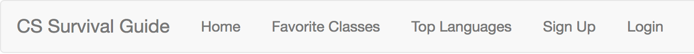
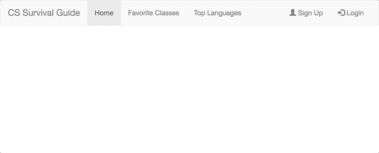

# CS52 Bootstrap Workshop

Welcome to the CS52 workshop session on Bootstrap.  During this workshop, you will learn the basics of using the Bootstrap framework by creating a clean, responsive, and mobile friendly web page.

## Workshop Overview

For this workshop, you will be asked to incorporate many of the components of Bootstrap into a simple website. Your challenge, should you choose to accept it, is:

*Take the poorly formatted and un-styled HTML that we have provided for you in this workshop and use Bootstrap to turn it into a masterpiece, without using any CSS.*

In order to complete the challenge, follow these steps:

1. [Fork the repository](#fork-the-repo)
2. [Set up Bootstrap](#set-up-bootstrap)
3. [Create the Navigation Bar](#navigation-bar)
4. [Add a Jumbotron](#jumbotron)
5. [Encapsulate Content in a Grid Layout](#grid-layout)
6. [Style the footer](#footer)

## Fork the repo

To start our workshop, please clone [this](https://github.com/jgualtieri/workshop) repository to your computer. It contains a bare-bones HTML file with content that we will be starting with. Open it up – notice how ugly it looks right now?

## Set up Bootstrap

Setting up Bootstrap is simple – all you have to do is link it into the html from a CDN.  For example, you can link in Bootstrap by including the following line in the `<head>` of your HTML:

`<link rel="stylesheet" href="https://maxcdn.bootstrapcdn.com/bootstrap/3.3.7/css/bootstrap.min.css">`

Also, add these scripts to the very end of the `<body>` (only necessary for certain mobile responsive features):

``

``

Lastly, to ensure proper rendering and touch zooming, add the following `<meta>` tag inside the `<head>`:

`<meta name="viewport" content="width=device-width, initial-scale=1">`

## Navigation Bar

First, we will begin by setting up a simple navbar for the site. Bootstrap provides many different classes that can be used to customize a navbar.

To customize the navbar using Bootstrap, we will incorporate Bootstrap classes into the `<nav>` section of the HTML.  

To add a standard navbar, use `<nav class="navbar navbar-default">`.

Next, within the nav element, add the `container-fluid` class to the div – this class creates a full width container spanning the entire width of your viewport.

To make the title of the website a header, add the `navbar-header` class to the "Dartmouth CS Survival Guide" div and `navbar-brand` to the anchor tag. This will give the text a slightly larger size.

To add links to the navbar, simply add to _both_ unordered list tags the classes `nav navbar-nav`.

At this point, it should look miles better already!

All just by adding a few simple classes to your HTML. But let's make it a little better.

Often times, you want to align specific parts of the navbar to the left or right. Let's do that here. Add the `navbar-right` class to the unordered list tag containing the "Sign Up" and "Login" items.

To indicate that the Home page is the page we are currently on, add the `active` class to Home's list item element.

Now, let's make this navbar responsive. We will make the navigation bar  hidden on small screens and replaced by a button in the top right corner.

The first step to adding this is to add the button itself. Add a `button` tag inside the `navbar-header` div, with the following attributes:
* type: button
* class: navbar-toggle
* data-toggle: collapse

For the actual display button, create a "hamburger" button using the `.icon-bar` class. Inside the button tag, add a few copies of ``, however many you like.

Now, the content that you want to actually be collapsed when the screen is narrow needs to be wrapped in a `
` with classes `collapse` and `navbar-collapse`. For example, if you want to remove everything except for the header, wrap the two unordered lists in a div with those classes.

Lastly, to connect the hamburger button to the collapsing content, add and match the `data-target` attribute of your button to the `id` of your collapsing div. For those of you who completed the CSS Checkbox Hack for Lab 1, this step is similar to linking the `input` and `label` elements. Just like that, you have a responsive menu navigation bar!

As a final touch, add icons to the two right items. Inside these two list item tags and within the anchor tags, add `&nbsp;` and `&nbsp;` (note the space codes separating the icon and the following text), respectively.

And that's it! Note that many variations of this exist, such as `navbar-inverse` instead of `navbar-default` to invert the colors, or `navbar-fixed-top` to pin to the top even when scrolling (try it out). If you're interested in more complex Bootstrap navigation bar examples, there are many links online demonstrating additional features.

## Jumbotron

A jumbotron indicates a big box for calling extra attention to some special content or information. To create a jumbotron in Bootstrap, replace the `page_header` class in the corresponding div with `jumbotron`. See the instant difference!

To ensure that the jumbotron doesn't extend to the edge of the screen, you can place the jumbotron inside of a div with the `container` class.

## Grid Layout

The HTML that we have provided for you is laid out vertically. Use the Bootstrap preset grid layout to align the content in an arrangement that is more visually appealing.

## Footer

There aren't many things for footers specifically in Bootstrap, but the tools you have used in the first three parts should be enough to have a decent style. Try to make your footer look like the image below, using the various classes we have previously used.

(Need a hint? Try using the various container/nav-related classes from above)

## What you should have at this point

Four sections, each of which should be nicely formatted and responsive
* Navigation bar
* Jumbotron
* Grid layout
* Footer

__*Now, to complete the Bootstrap workshop, add one extra feature on your own. We have a few suggestions below, but feel free to pick something not listed if you wish:*__

1. Tabs/Pills
2. Modals
3. Carousels
4. Scrollspy (advanced)

__Be creative!__ One of the best parts about Bootstrap is that there are an endless amount of features and classes already built-in, and extra ones are being added with every new version.

We hope this workshop has demonstrated to you the power of Bootstrap. Without any CSS you quickly applied a basic format and style to plain HTML; keep in mind that although there is a still a lot of work left to be done on this page, having Bootstrap handle so much of the initial styling makes adding in your own customized CSS on top even less painful!

## Additional Resources

* https://www.w3schools.com/bootstrap/
* https://scotch.io/bar-talk/bootstrap-3-tips-and-tricks-you-might-not-know
